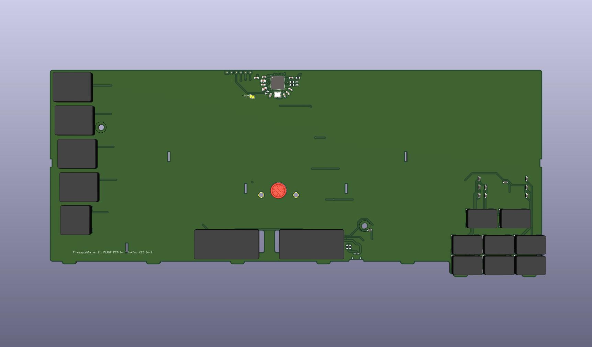
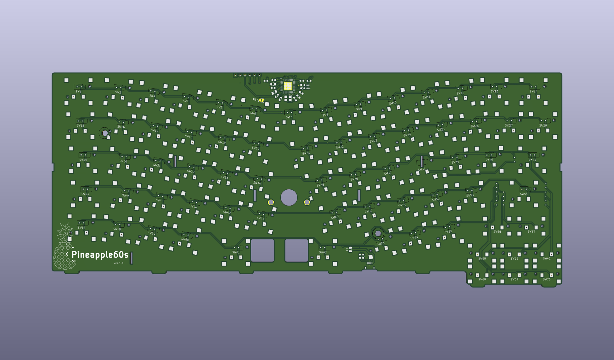
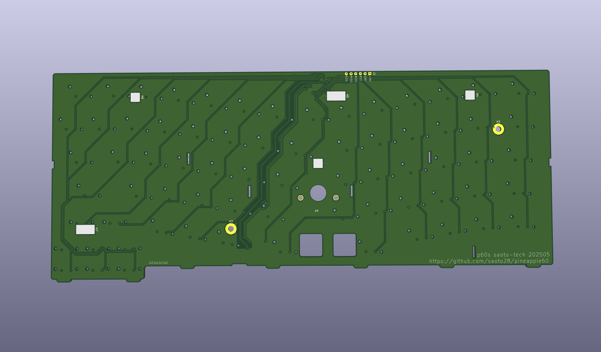

# Pineapple60s PCB design
## prerequisite
CAD: KiCAD 8

## history
### pineapple60s1_1_plane.* : remove key layouts from ver.1.1

### (pineapple60s1_1.* : ver.1.1, fixed some manual corrections made when installing ver. 1.0 at 2025-06)

### pineapple60s1_0a.* : same as ver 1.0, but, changed library folder location at 2025-06

[pineapple60s ver.1.0a schematic](images_and_pdf/pineapple60s1_0a_sch.pdf)

### (pineapple60s1_0.* : pineapple60s ver.1.0 first produced at 2025-05)
